# 实验一 : 白盒测试工具Junit

**71119103 许润**

[TOC]

## 一、安装maven和junit

### 1、安装maven

①点此进入[maven官网](https://maven.apache.org/download.cgi)下载

②选择左侧的`Download`

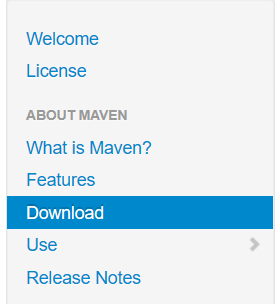

③点击链接进行下载

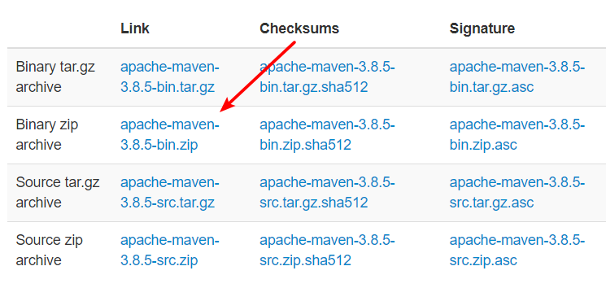

④打开cmd，输入`mvn-version`验证maven是否安装成功

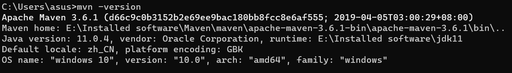

### 2、新建maven项目

①点击`File`—>`New`—>`Project`

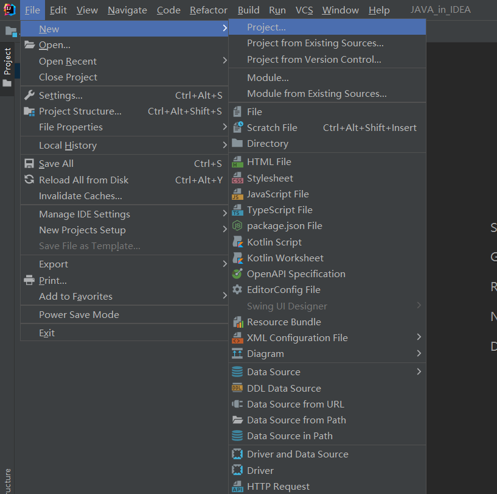

②选择`maven`，创建名为`Junit`的maven项目

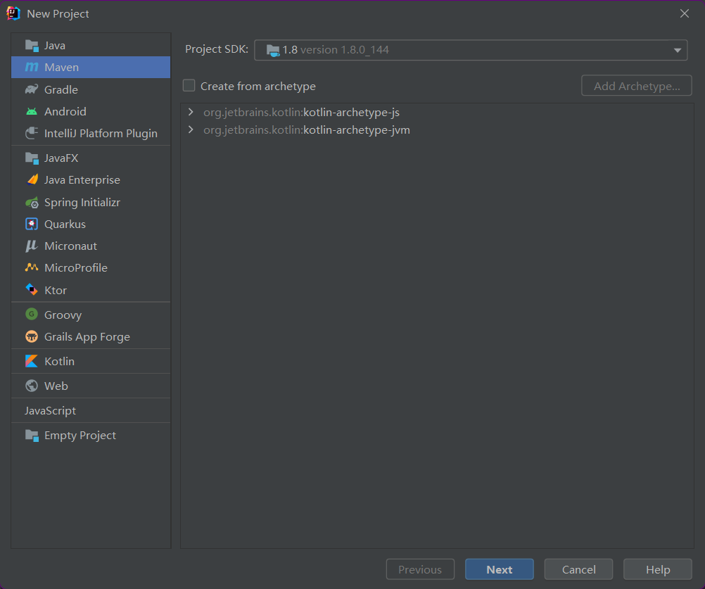

### 3、导入Junit的jar包

①、进入[Maven仓库](https://mvnrepository.com/)

②、选择最新的Junit，复制到`pom.xml`中

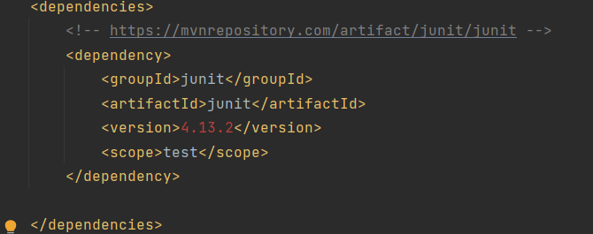

③刷新，自动将包下载下来

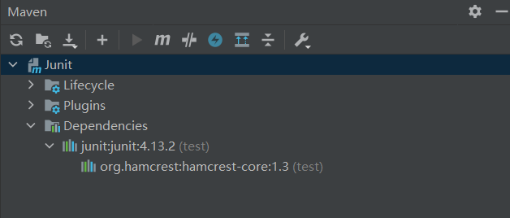

**至此，已经成功导入了Junit！**


## 二、完成课件基本实验内容

> 观察项目目录可以发现，scr下有两个文件夹，分别为`main`和`test`,其中`main->java`目录下开发项目，`test->java`目录下编写测试文件。

### 1、基本使用

> 我们在`main->java`目录下创建**TestJunit**类作为测试用例，`test->java`目录下编写测试文件**TestDemo**来对测试用例进行测试，并且用**TestRunner**来打印输出测试结果文件。

**TestJunit.class**

```java
package demo;

public class TestJunit {
    private String message;

    public TestJunit(String message){
        this.message = message;
    }

    public String print(){
        System.out.println(this.message);
        return message;
    }
}
```

**TestDemo.class**

```java
import demo.TestJunit;
import org.junit.Test;

import static org.junit.Assert.*;

public class TestDemo {
    private String message = "Hello Word!";
    private TestJunit t1 = new TestJunit(message);

    @Test
    public void test(){
        assertEquals(message,t1.print());
    }
}
```

**TestRunner.class**

```java
import org.junit.runner.JUnitCore;
import org.junit.runner.Result;
import org.junit.runner.notification.Failure;

public class TestRunner {
    public static void main(String[] args) {
        Result result = JUnitCore.runClasses(TestDemo.class);
        for(Failure failure:result.getFailures()){
            System.out.println(failure.toString());
        }
        System.out.println("测试结果：" + result.wasSuccessful());
    }
}
```

**内容相等和修改字符串内容后，使其不相等，分别运行TestRunner.class,两种结果如下：**

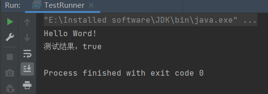

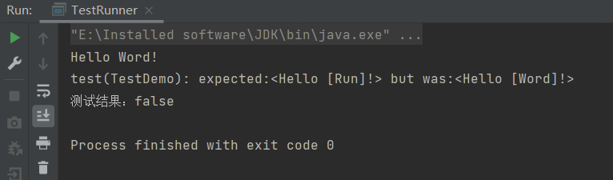


### 2、Junit套件测试

> 测试套件就是捆绑几个单元测试用例并且一起执行它们。在Junit中，@RunWith和@Suite注
>
> 解用来运行套件测试。
>
> 我们在在test->java的目录中创建**TestDemo2**测试文件，以及**TestSuite**类来捆绑**TestDemo**和**TestDemo2**这两个单元测试用例并且一起执行它们。

**TestDemo2.class**

```java
import demo.TestJunit;
import org.junit.Test;
import static org.junit.Assert.*;

public class TestDemo2 {
    private String message = "Hello Word!";
    private TestJunit t1 = new TestJunit(message);

    @Test
    public void test(){
        message = "123";
        assertEquals(message,t1.print());
    }
}
```

**TestSuite.class**

```java
import org.junit.runner.RunWith;
import org.junit.runners.Suite;

@RunWith(Suite.class)
@Suite.SuiteClasses({
        TestDemo.class,
        TestDemo2.class,
})
public class TestSuite {
}
```

**结果输出如下：**可以发现TestDemo和TestDemo两个测试用例皆执行

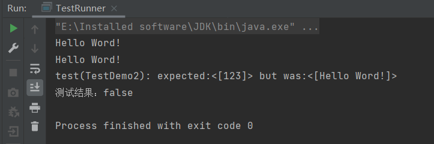

### 3、Junit时间测试

> 如果一个测试用例比起指定的毫秒数花费了更多的时间，那么Junit将自动将它标记为失败。timeout 参数和 @Test 注释一起使用。

本例中我们修改**TestDemo**类，为其设置一个`timeout`为2000的`@Test`注释，并在`test()`方法中添加一个时间休眠。

**TestDemo.class**

```java
import demo.TestJunit;
import org.junit.Test;

import static org.junit.Assert.*;

public class TestDemo {
    private String message = "Hello Word!";
    private TestJunit t1 = new TestJunit(message);

    @Test(timeout = 2000)
    public void test(){
        try{
            Thread.sleep(5000);
        }catch (InterruptedException e){
            e.printStackTrace();
        }
        assertEquals(message,t1.print());
    }
}
```

**输出结果如下：**

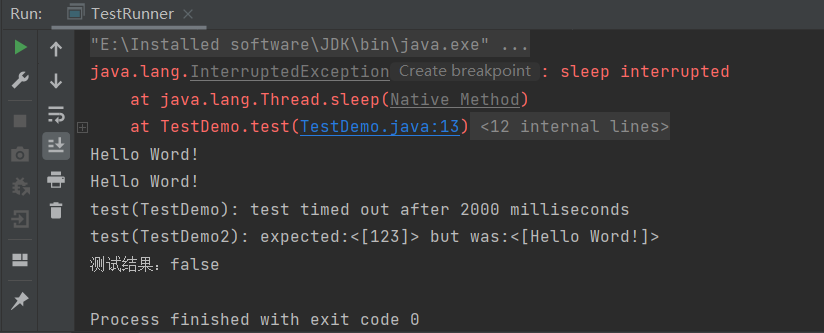

可以发现TestDemo报错：test timed out after 2000 milliseconds；在上面的例子中，test() 方法将在5000milliseconds后返回，超出了预定的时间，因此JUnit引擎将其标记为超时。

### 4、Junit异常测试

>  在写单元测试的时候，经常会遇到需要断言方法需要抛出一个异常这种场景，这时，就会用到Junit的异常测试功能。此时可以使用@Test注解自带的 expected 属性来断言需要抛出一个异常。 在运行测试的时候，此方法必须抛出异常，这个测试才算通过，反之则反。

本例中我们修改**TestDemo**类，为其设置一个名为`ArithmeticException`的异常。如果i小于0，那么就抛出一个ArithmeticException。

**TestDemo.java**

```java
import demo.TestJunit;
import org.junit.Test;

import static org.junit.Assert.*;

public class TestDemo {
    private String message = "Hello Word!";
    private TestJunit t1 = new TestJunit(message);

    @Test(expected = ArithmeticException.class)
    public void test(){
        Student s1 = new Student();
        s1.test(-1);
    }
}

class  Student{
    public boolean test(int i) {
        if(i<0){
            throw new IllegalArgumentException("我是异常！");
        }else{
            return true;
        }
    }
}
```

**输出结果如下：**

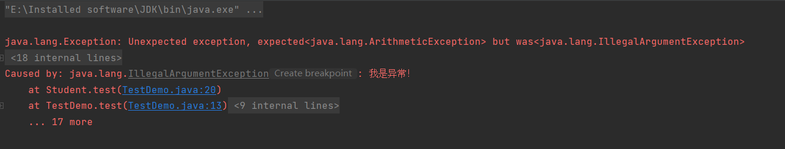

可以发现用于测试代码抛出一个ArithmeticException异常。

### 5、Junit参数化测试

> 参数化测试允许开发人员使用不同的值反复运行同一测试。有以下5个步骤：
>
> 1、用RunWith(Parameterized.class)来注释test类。
>
> 2、创建一个由@Parameter注释的公共静态方法，它返回一个对象的集合（数组）来作为测试数据集合。
>
> 3、创建一个公共的构造函数，它接受和一行测试数据相等同的东西。
>
> 4、为每一列测试数据创建一个实例变量。
>
> 5、用实例变量作为测试数据的来源来创建你的测试用例。

本例中我们创建PrimeNumberChecker类，作为被测试的对象，判读输入的数是否为一个质数。创建测试类TestPrimeNumberChecker，使用@Parameterized.Parameters指定测试参数，并使用@RunWith(Parameterized.class)将测试参数绑定到测试方法中。

**PrimeNumberChecker.class**

```java
package demo;

public class PrimeNumberChecker {
    public boolean validate(final int num){
        for(int i = 2;i<(num/2);i++){
            if(num%i==0){
                return false;
            }
        }
        return true;
    }
}
```

**TestPrimeNumberChecker.class**

```java
import demo.PrimeNumberChecker;
import org.junit.Before;
import org.junit.Test;
import org.junit.runner.RunWith;
import org.junit.runners.Parameterized;
import static org.junit.Assert.*;
import java.util.Arrays;
import java.util.Collection;

@RunWith(Parameterized.class)
public class TestPrimeNumberChecker {
    private int inputNum;
    private boolean expectedRes;
    private PrimeNumberChecker primeNumberChecker;

    @Before
    public void initialize(){
        primeNumberChecker = new PrimeNumberChecker();
    }


    public TestPrimeNumberChecker(int inputNum,boolean expectedRes){
        this.inputNum = inputNum;
        this.expectedRes = expectedRes;

    }

    @Parameterized.Parameters
    public static Collection primeNumber(){
        return Arrays.asList(new Object[][]{
                {2,true},
                {6,false},
                {19,true},
                {22,false}
        });
    }

    @Test
    public void testPrimeNumberChecker(){
        System.out.println("Parameterized Number is: " + inputNum);
        assertEquals(expectedRes,primeNumberChecker.validate(inputNum));
    }
}
```

**输出结果如下：**

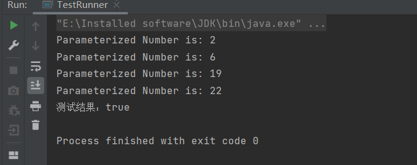

## 三、使用Junit的6个注解

> - `@Test` 指定一个测试案例
>
> - `@Before` 指定该方法需要在@Test方法前运行，该方法会针对每一个测试用例执行，且在测试方法前执行。**注意：**必须是public void，不能为static。不止运行一次，根据用例数而定。
>
> - `@After` 指定该方法需要在@Test方法后运行，该方法会针对每一个测试用例执行，且在测试方法后执行
>
> - `@BeforeClass` 指定该方法需要在类中所有方法前运行，对应的方法会首先执行，且执行一次。当我们运行几个有关联的用例时，可能会在数据准备或其它前期准备中执行一些相同的命令，这个时候为了让代码更清晰，更少冗余，可以将公用的部分提取出来，放在一个方法里，例如创建数据库连接、读取文件等。**注意：**方法名可以任意，但必须是public static void，即公开、静态、无返回。这个方法只会运行一次。
>
> - `@AfterClass` 指定该方法需要在类中所有方法后运行，对应的方法会最后执行，且执行一次。**注意：**同样必须是public static void，即公开、静态、无返回。这个方法只会运行一次。
>
> - `@Ignore` 指定不需要执行测试的方法。有时候我们想暂时不运行某些测试方法\测试类，可以在方法前加上这个注解。在运行结果中，junit会统计忽略的用例数，来提醒你。但是不建议经常这么做，因为这样的坏处时，容易忘记去更新这些测试方法，导致代码不够干净，用例遗漏。

我们来试验一下，我新建一个测试类AnnotationTest，然后每个注解都用了，其中有两个用@Test标记的方法分别是test1和test2，还有一个用@Ignore标记的方法test3。

**AnnotationTest.class**

```java
import org.junit.*;
import static org.junit.Assert.*;

/**
 * Created by xurun on 2022/3/26.
 */
public class AnnotationTest {
    
    @BeforeClass
    public static void setUpBeforeClass() {
        System.out.println("BeforeClass");
    }

    @AfterClass
    public static void tearDownAfterClass() {
        System.out.println("AfterClass");
    }

    @Before
    public void setUp() {
        System.out.println("Before");
    }

    @After
    public void tearDown() {
        System.out.println("After");
    }

    @Test
    public void test1() {
        System.out.println("test1");
    }

    @Test
    public void test2() {
        System.out.println("test2");
    }

    @Ignore
    public void test3() {
        System.out.println("test3");
    }

}
```

**运行结果如下：**

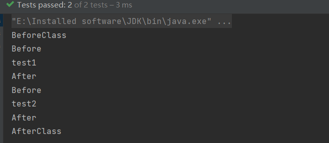

**解释一下：**`@BeforeClass`和`@AfterClass`在类被实例化前就被调用了，而且只执行一次，通常用来初始化和关闭资源。`@Before`和`@After`和在每个`@Test`执行前后都会被执行一次,所以在`test1`执行前后各执行一次，在`test2`执行前后各执行一次。被`@Ignore`标记的test3方法没有被执行。


进一步做实验，添加一个成员变量：

```java
int i = 0;
```

然后把test1改为：

```java
i++;
System.out.println("test1的i为" + i);
```

然后把test2改为：

```java
i++;
System.out.println("test2的i为" + i);
```

**运行结果如下：**

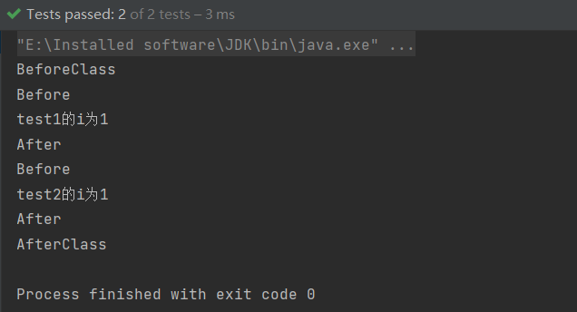

可以看到`test1`和`test2`的`i`都只自增了一次，所以`test1`的执行不会影响`test2`，因为执行`test2`时又把测试类重新实例化了一遍。如果希望`test2`的执行受`test1`的影响怎么办呢？可以把int i改为static 。


**最后关于这些注解还有一个要说明的就是，你可以把多个方法标记为@BeforeClass、@AfterClass、@Before、@After。他们都会在相应阶段被执行。**