# 实验三 : 性能测试工具

**71119103 许润**

[TOC]

## 一、JMeter

> JMeter是Apache组织开发的基于Java的压力测试工具。用于对软件做压力测试，它最初被设计用于Web应用测试，但后来扩展到其他测试领域。 它可以用于测试静态和动态资源，例如静态文件、Java 小服务程序、CGI 脚本、Java 对象、数据库、FTP 服务器 等等。JMeter 可以用于对服务器、网络或对象模拟巨大的负载，来自不同压力类别下测试它们的强度和分析整体性能。另外，JMeter能够对应用程序做功能/回归测试，通过创建带有断言的脚本来验证你的程序返回了你期望的结果。为了最大限度的灵活性，JMeter允许使用正则表达式创建断言。

### Ⅰ、安装JMeter

#### 1、[JMeter下载地址](https://jmeter.apache.org/download_jmeter.cgi)(JDK已经安装并配置完成，此处不再赘述)

进入官网，选择相应的版本，本机为windows系统，故选择第二个[apache-jmeter-5.4.3.zip]。

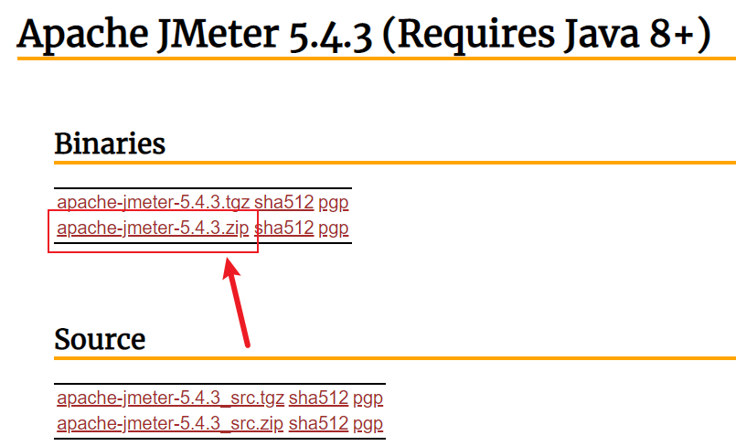

#### 2、下载完成后进行解压

解压后无需安装，解压后目录如下。

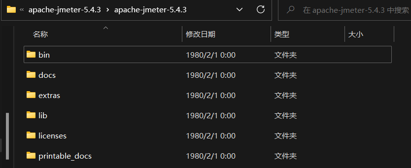

#### 3、配置环境变量

编辑Path环境变量，变量值为JMeter解压的路径。

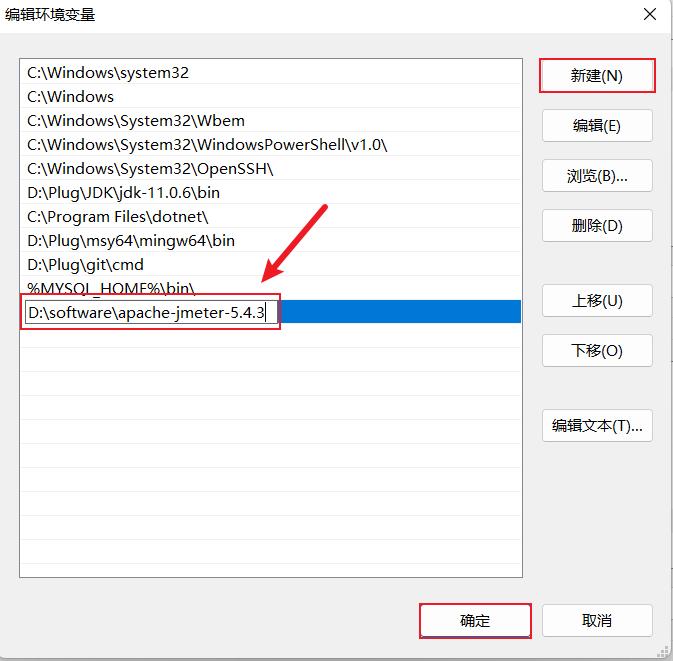

#### 4、打开JMeter

打开JMeter中bin目录下面的jmeter.bat文件即可打开JMeter。打开后有两个窗口，Jmeter的命令窗口和Jmeter的图形操作界面，不要关闭命令窗口。

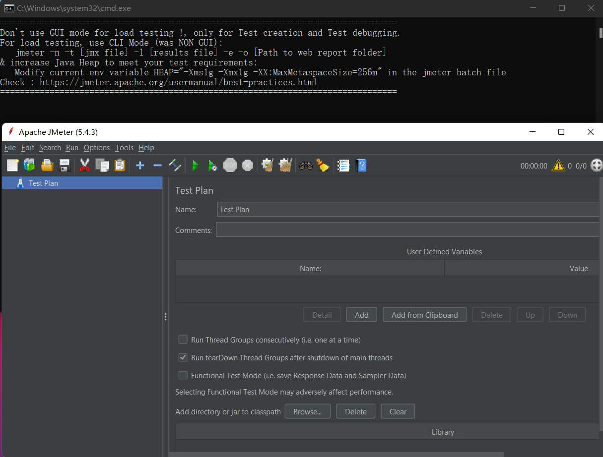

### Ⅱ、JMeter介绍

#### 1、JMeter主要元件

> **1、测试计划：**是使用 JMeter 进行测试的起点，是其它 JMeter测试元件的容器。
>
> **2、线程组：**代表一定数量的用户，可以用来模拟用户并发发送请求。实际的请求内容在取样器中定义，被线程组包含。
>
> **3、配置元件：**维护取样器需要的配置信息，并根据实际的需要修改请求的内容。
>
> **4、前置处理器：**负责在请求之前工作，常用来修改请求的设置
>
> **5、定时器：**负责定义请求之间的延迟间隔。
>
> **6、取样器：**是性能测试中向服务器发送请求，记录响应信息、响应时间的最小单元，如：HTTP 请求、FTP请求等，每一种不同类型的取样器可以根据设置的参数向服务器发出不同类型的请求。
>
> **7、后置处理器：**负责在请求之后工作，常用于获取返回的值。
>
> **8、断言：**用来判断请求响应的结果是否如用户所期望的。
>
> **9、监听器：**负责收集测试结果，同时确定结果显示的方式。
>
> **10、逻辑控制器：**可自定义JMeter发送请求的行为逻辑，与Sampler结合使用可以模拟复杂的请求序列。

#### 2、JMeter元件的作用域和执行顺序

> **1、元件作用域**
>
> 配置元件：影响其作用范围内的所有元件。
>
> 前置处理器：在其作用范围内的每一个取样器元件之前执行。
>
> 定时器：在其作用范围内的每一个取样器有效。
>
> 后置处理器：在其作用范围内的每一个取样器元件之后执行。
>
> 断言：在其作用范围内的对每一个取样器元件执行后的结果进行校验。
>
> 监听器：在其作用范围内对每一个取样器元件的信息收集并呈现。
>
> **2、元件执行顺序：**
>
> 配置元件->前置处理器->定时器->取样器->后置处理程序->断言->监听器

## 二、完成课件基本实验内容

### Ⅰ、http cookie、http 信息头使用场景

#### 1、HTTP Cookie管理器

> HTTP Cookie管理器可以像浏览器一样存储和发送cookie，如果你要发送一个带cookie的http请求，cookie manager会自动存储该请求的cookies，并且后面如果发送同源站点的http请求时，都可以用这个cookies。

#### 2、HTTP请求

> (1)名称：用于标识一个取样器，建议使用一个有意义的名称。
>
> (2)注释：对于测试没有任何作用，仅用户记录用户可读的注释信息。
>
> (3)服务器名称或IP ：HTTP请求发送的目标服务器名称或IP地址。
>
> (4)端口号：目标服务器的端口号，默认值为80 。
>
> (5)协议：向目标服务器发送HTTP请求时的协议，可以是HTTP或者是HTTPS ，默认值为http 。
>
> (6)方法：发送HTTP请求的方法，可用方法包括GET、POST、HEAD、PUT、TRACE、OPTIONS、 DELETE等。
>
> (7)路径：目标URL路径。
>
> (8)内容编码：内容的编码方式，默认值为iso8859。
>
> (9)自动重定向：如果选中该选项，当发送HTTP请求后得到的响应是302/301时，JMeter自动重定向到新页面。
>
> (10)使用keep Alive ：保持JMeter 和目标服务器之间的活跃状态，默认选中。
>
> (11)对Post使用multipart/from-data：当发送POST 请求时，使用multipart/from-data方法发送。
>
> (12)同请求一起发送参数 ：在请求中发送URL参数，对于带参数的URL ，JMeter提供了一个简单的对参数化的方法。用户可以将URL中所有参数设置在本表中，表中的每一行是一个参数值对（对应RUL中的名称1=值1）。

### Ⅱ、响应断言中的测试字段

> Apply to指断言作用范围，通常发出一个请求只触发一个请求，则勾选“main sample only”即可；若发一个请求可以触发多个服务器请求，就有main sample 和sub-sample之分。
>
> 测试字段分为响应文本、响应代码、响应信息、响应头、请求头、URL样本、文档(文本)、忽略状态、请求数据。
>
> 模式匹配规则：包括、匹配、字符串、相等、否、或者。

本次响应断言测试以查询天气为例，测试响应文本、响应代码、响应头这三个测试字段。

**第一步：**创建线程组。JMETER的所有任务都必须线程处理，可以理解为WEB的请求就是一个线程组，所以需要模拟线程组来实现功能。

**第二步：**创建一个请求，获取城市代码。发送一个Get 方法的http 请求：https://www.tianqiapi.com/free/day?appid=54688262&appsecret=0Q1MsbAh?city=上海

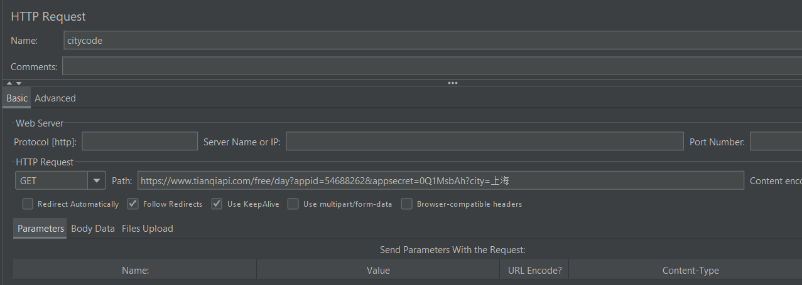

**第三步：**添加响应断言、断言结果。

①响应文本

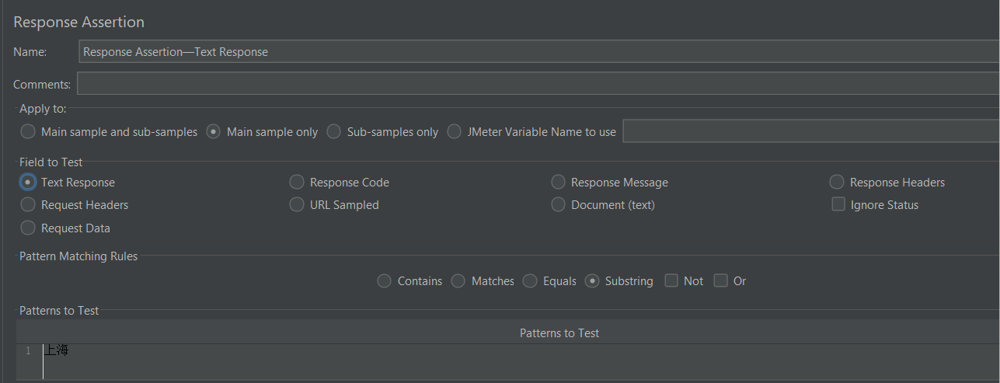

②响应代码

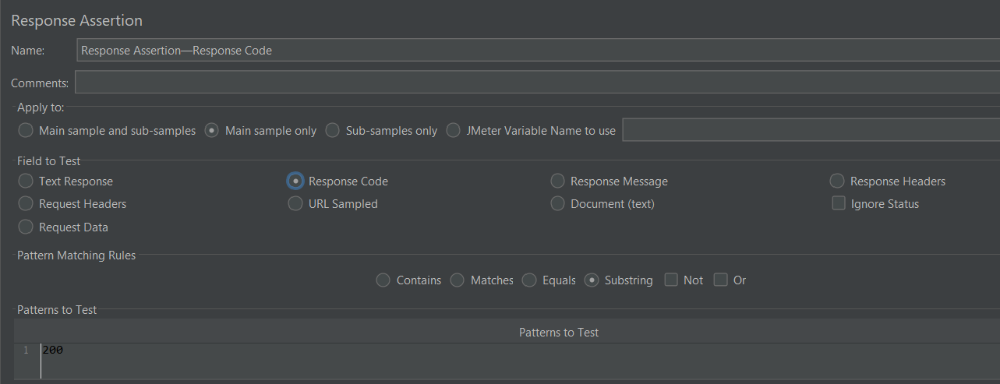

③响应头

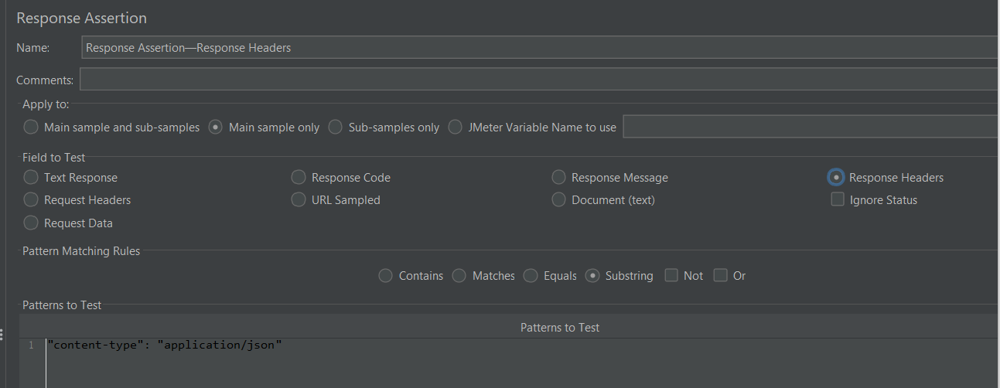

**第四步：**创建结果树。创建结果树，当然就是为了看执行结果了，当然还有其他接听结果的，请自行选择。操作：右键线程组添加——监听器——查看结果树。

**第五步：**执行结果。点击执行按钮就可以执行前面编写的citycode请求信息了，通过为绿色，出现问题为红色。执行结果如下：三个断言均成功！！

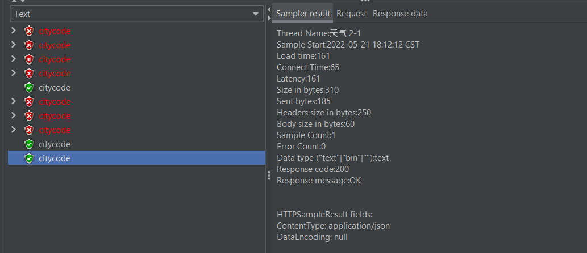

### Ⅲ、性能测试步骤

#### 1、添加线程组

> 进入测试计划，添加一个线程组，线程属性中确定的三个参数表明有20个虚拟用户，每次要10秒全部执行完，循环次数为5次。

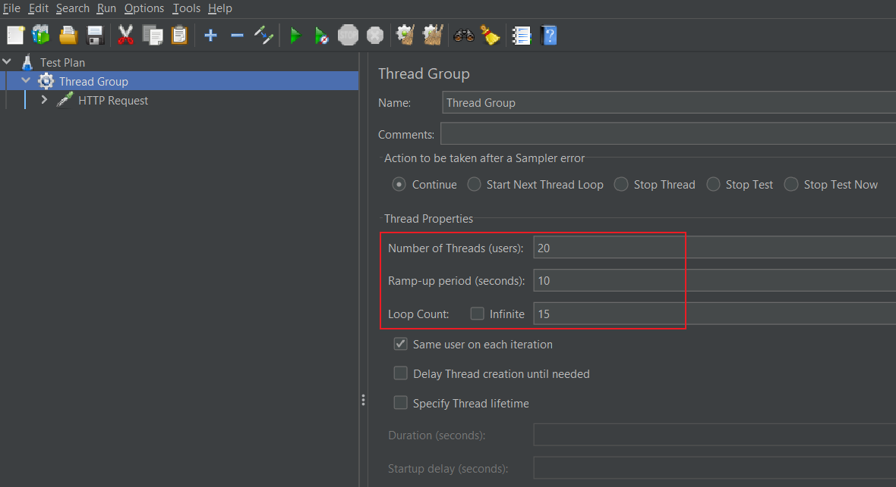

#### 2、添加HTTP请求

> 在线程组上点击右键，添加HTTP请求。在HTTP请求下的“路径”栏里，填写想要测试的URL，以搜狗主页https://www.sogou.com/为例。

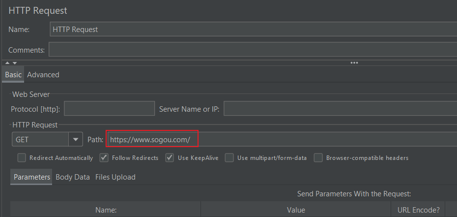

#### 3、添加监听器

> 在HTTP请求上点击右键，添加监听器，如用表格查看结果、聚合报告。在点击绿色运行按钮后，可查看结果。

表格查看结果：

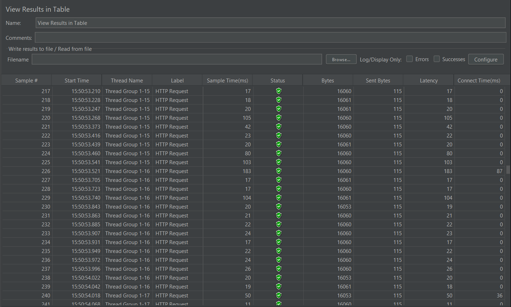

聚合报告结果：

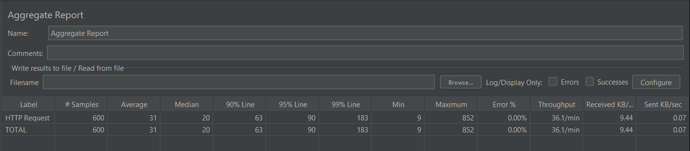

#### 4、执行测试计划

> 执行测试计划不能适用GUI界面进行，需要在控制台通过指令执行，在控制台输入图片提示指令执行对应的测试计划。

执行结果如下：

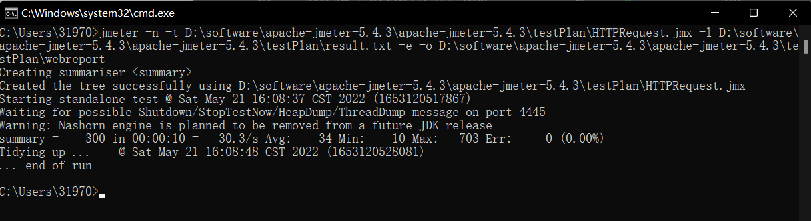

#### 5、查看测试计划执行结果

> 打开生成的webreport文件夹，打开index.html文件，可以通过Dashboard查看测试计划执行结果，如下：

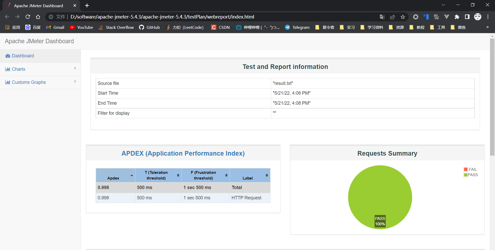

#### 6、测试结果分析

**（1）Test and Report informations 测试和报告信息**

> - **Source file：**jtl 文件名
> - **Start Time ：**压测开始时间
> - **End Time ：**压测结束时间
> - **Filter for display：**过滤器

**（2）APDEX(Application performance Index) 应用程序性能指数表**

> 基于容忍和满足的阈值，为每个事务计算 APDEX 。性能指数，Apdex(Application Performance Index)是一个国际通用标准，Apdex 是用户对应用性能满意度的量化值。它提供了一个统一的测量和报告用户体验的方法，把最终用户的体验和应用性能作为一个完整的指标进行统一度量。
>
> - **Apdex：**应用程序性能指标，在这里代表当前事务的性能指标，范围在0~1之间，1表示达到所有用户均满意
> - **T(Toleration threshold)：**容忍的阈值，500ms
> - **F(Frustration threshold)：**无法接受的阈值，1.5s
> - **label：**事务名称（请求名）

基于应用程序性能指数表，我们可以发现此事务【HTTP Request】的应用程序性能指标值为0.998，说明性能非常良好，可以满足99.8%的用户。

**（3）Requests Summary 请求摘要图**

> 显示成功和失败的请求，不考虑事务控制器样本结果。

从图中的请求摘要图，不难看出请求的通过率为100%，失败率为0%，说明所有的请求均成功。

**（4）Statistics 统计表**

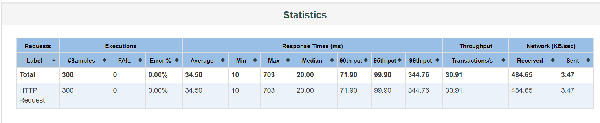

> 相当于聚合报告。
>
> - Lable:sampler采样器名称
> - #Samples:请求总数，并发数循环次数
> - FAIL:失败次数
> - Error%:失败率
> - Average:平均响应时间
> - Min:最小响应时间
> - Max:最大响应时间
> - 90th pct: 90%的用户响应时间不会超过这个值(关注这个就可以了) 2ms,3ms,4.5,2,6,8,3,9
> - 95th pct: 95%的用户响应时间不会超过这个值
> - 99th pct: 99%的用户响应时间不会超过这个值(存在极端值)
> - Throughtput:Request per Second吞吐量qps
> - Received:每秒从服务器接收的数据量
> - Send:每秒发送的数据量

分析统计表，对于此采样器，共有300个请求，失败次数为0，失败率为0%，平均响应时间为34.50，最小响应时间为10ms，最大响应时间为703ms，吞吐量为30.91，接收速度为484.65/s，发送速度为3.47/s。总体来说性能较好。

**（5）Errors 错误表**

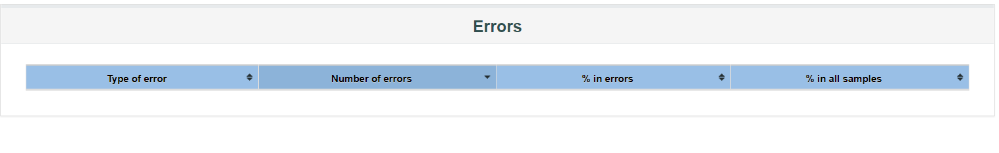

> 提供了所有错误及其在总请求中所占比例

错误数为0，因此错误表为空。

**（6）Top 5 Errors by sampler**

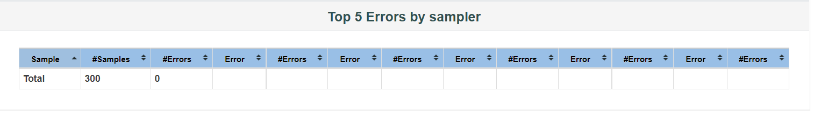

> 为每个 Sampler（默认情况下不包括事务控制器）提供前五个错误信息摘要和错误数，若没有则不显示在上面，最多显示 5 个。

错误数为0，因此Top5 错误表为空。

## 三、思考题

### Ⅰ、压力测试、性能测试、负载测试的区别与联系

> 根据产品的时间特性和资源特性，效率测试可以包括不同的测试类型，例如：**性能测试**（PerformanceTest）、**负载测试**（Load Test）和**压力测试**（Stress Test）。这三种效率测试类型，不仅在具体定义上面有不同的侧重点，同时相互之间又是密切关联的。

**（1）性能测试**

性能测试主要评价系统或组件的性能是否和具体的性能需求一致，例如：对访问速度的性能需求或对内存使用情况的需求。特定性能测试的关注点在于组件或系统在规定的时间内和特定的条件下响应用户或系统输入的能力。

不同的性能的度量方法取决于不同的被测对象。对于一个单独软件组件，其性能可以根据CPU主频来判定。而带客户端的系统，其性能则要根据系统处理特定用户请求的响应时间来判定。对于那些由多种组件（如客户端、服务器、数据库）构成的系统，则要进行各组件之间的性能测试。

性能测试关注的是系统性能是否和具体的性能需求相一致，而当系统性能超过性能需求的时候，系统的表现并不是测试人员关心的重点。

例如：性能需求中要求系统应该支持最大同时在线用户为5000个，那么在性能测试过程中重点测试系统是否能支持5000个用户同时在线；当有5000个用户同时在线后，性能测试需要关注整个系统的运行是否符合要求；而对于在线用户超过5000人的时候，系统的表现行为并不是性能测试需要关注的。

**（2）负载测试**

负载测试是一种通过增加负载来评估组件或系统的性能的测试方法。例如：通过增加并发用户数和（或）事务数量来测量组件或系统能够承受的负载。负载测试和性能测试的主要区别在于负载测试时，系统负载是逐渐增加的，而不是一步到位，负载测试需要观察系统在各种不同的负载情况下是否都能够正常工作。

**（3）压力测试**

压力测试是评估系统处于或超过预期负载时系统的运行情况。压力测试的关注点在于系统在峰值负载或超出最大载荷情况下的处理能力。在压力级别逐渐增加时，系统性能应该按照预期缓慢下降，但是不应该崩溃。压力测试还可以发现系统崩溃的临界点，从而发现系统中的薄弱环节。

例如：系统最大支持的同时在线用户数是1000个，压力测试需要测试在1000个用户甚至2000个用户同时在线时系统的表现。虽然测试时负载已经超过了系统的设计能力，但是在这种情况下被测试系统也不应该发生崩溃。压力测试也可以针对系统资源进行测试，例如：在系统内存耗尽情况下，测试系统的运行情况，这种情况下被测试系统也不应该崩溃。

**所以，最后总结（个人见解）就是：**

**联系：**三者测试得手段和方法在一定程度上比较相似，通常会使用相同的测试环境和测试工具，而且都会监控系统所占用资源的情况以及其他相应的性能指标。

**区别：**三者的测试目的不同。性能测试是为了获得系统在某种特定的条件下的性能指标数据；负载测试是为了获得系统正常工作时所能承受的最大负载；压力测试强调的是系统在高负载的情况下能否稳定运行。

### Ⅱ、举例(2到3个性能测试场景)说明如何设计相应的测试用例

> 性能测试用例的设计，得看测试对象以及测试目标，依据实际业务来进行具体设计；一般而言，所谓的性能测试，大部分指的是对后端服务器的性能方面测试，当然测试过程中，可能会通过client，或者web端来辅助进行；随着性能测试的开展，与性能排查的越来越精准，最终可能针对web、以及client端的每个细节都会进行覆盖到；至于测试用例的设计，建议有的放矢，根据侧重点去设计，每条用例，尽量之测试一个点，观测一个点的性能情况。
>
> 对于实际业务而言，影响性能的因素很多，在需求澄清阶段需要与开发、项目经理等相关需求设计人员沟通，获取性能测试范围以及性能测试点，主要待确定要素：
>
> （1）  并发数（终端个数/用户数）；
>
> （2） 并发持续时间；
>
> （3）  业务类型及业务占比（用户的各操作比重）；
>
> （4）  生产环境基础数据量（对应数据库表的数据量）；
>
> （5） 预期响应时间；
>
> （6） 系统其他特殊性能值需求（如net I/O不能占用带宽1/2）。

**1、登录**

测试目的：测试100个虚拟用户并发时，系统登录的响应时间。

并发用户数：100个。

**模拟用户行为：**

1)进入登录界面。

2)输入用户名和密码，点击“登录”按钮。

预期结果：系统登录的响应时间不能超过5秒。

**2、进入联系人管理界面**

测试目的：测试进入联系人管理界面活动，系统进入联系人管理界面的响应时间。

并发用户数：25个。

**模拟用户行为：**

1)进入登录界面。

2)输入用户名和密码。

3)进入首页，在导航条处点击“联系人管理”按钮，进入联系人管理界面。

预期结果：系统处理进入联系人管理界面的响应时间不能超过5秒。

**3、新增联系人**

测试目的：测试提交新增联系人活动，系统提交新增联系人的响应时间。

并发用户数：25个。

**模拟用户行为：**

1)进入登录界面。

2)输入用户名和密码。

3)进入首页，在导航条处点击“联系人管理”按钮。

4)在联系人管理界面，点击“新增联系人”按钮。

5)填写待新增联系人信息，并提交。

预期结果：系统处理提交新增联系人信息的响应时间不能超过8秒。

