# 实验二 : 黑盒测试工具

**71119103 许润**

[TOC]

## 一、安装selenium和postman

### Ⅰ、安装selenium

> Selenium IDE是Firefox浏览器的一个插件，依附于谷歌浏览器、Firefox浏览器，是一款开源的web自动化的工具
>
> selenium IDE作用：
>
> 1. 进行自动化测试。方便回归测试，可代替80%的手工测试。
> 2. 辅助元素定位。快速进行元素定位，然后直接copy到webdriver或其他脚本开发工具中。
> 3. 辅助自动化脚本的编写。将某个业务录制完成后，可以导出脚本，支持Java、JavaScript、python三种语言。
> 4. 方便提交bug。当某个业务的bug不方便表述，或操作步骤比较复杂，可以直接将其脚本发送给开发人员。

#### 1、下载[Selenium IDE插件](https://github.com/SeleniumHQ/selenium-ide/releases)

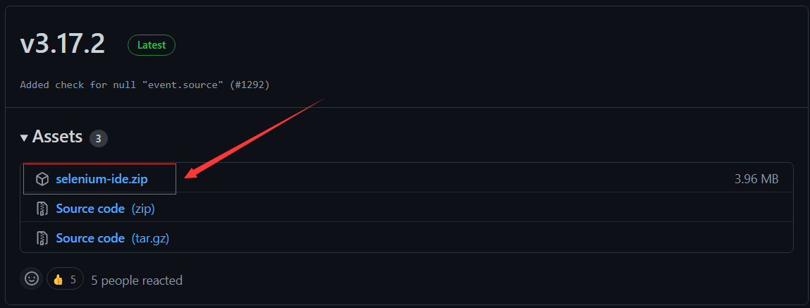

#### 2、Chrome浏览器安装Selenium IDE插件

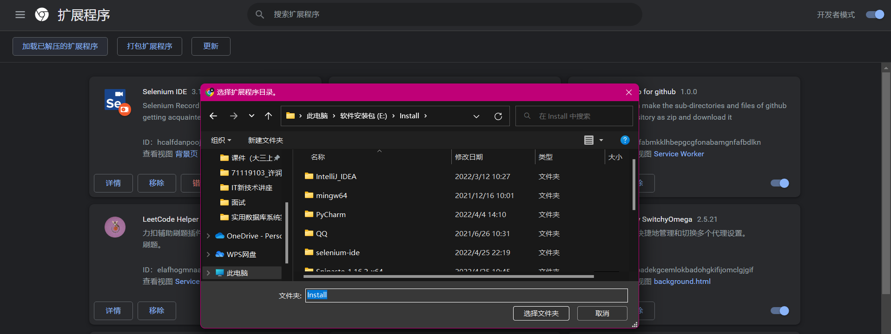

### Ⅱ、安装postman

> Postman 提供功能强大的 Web API 和 HTTP 请求的调试，它能够发送任何类型的HTTP 请求(GET, POST, PUT, DELETE…)，并且能附带任何数量的参数和 Headers。而且它还提供测试数据和环境配置数据的导入导出，付费的 Post Cloud 用户还能够创建自己的 Team Library 用来团队协作式的测试，并能够 将自己的测试收藏夹和用例数据分享给团队。
>
> postman适用于不同的操作系统，还支持postman浏览器扩展程序、postman chrome应用程序等。但是浏览器插件目前Google已经停止更新了。

#### 1、Postman的下载：[官网地址](www.postman.com/downloads/)

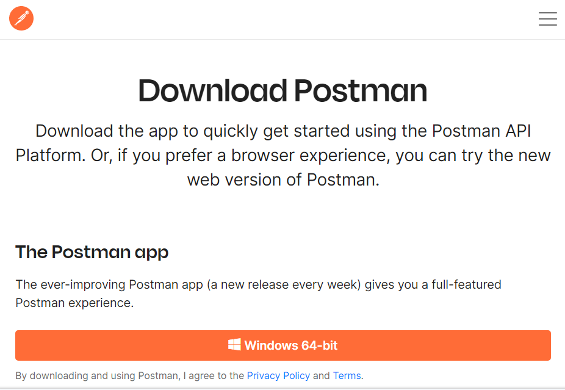

#### 2、Postman的安装过程

> ​    1、双击下载好的安装包。
>
> ​    2、因为Postman是免安装的，双击安装包，自动安装到本地电脑中。
>
> ​    3、查看Postman界面，出现如下图所示，说明安装成功。
>
> ​    4、登录，点击进入workspace页面。

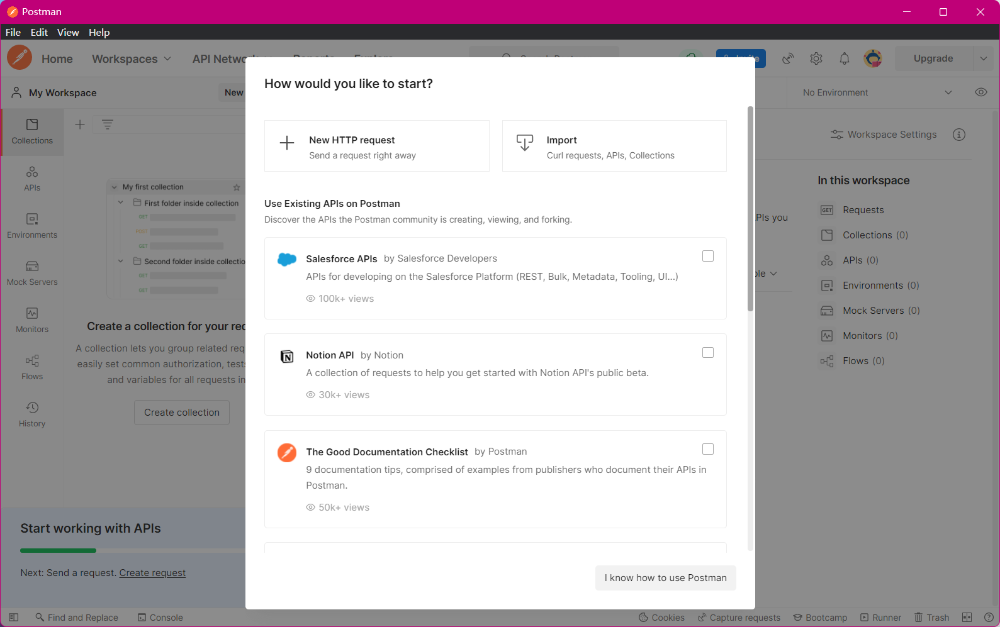

## 二、完成课件基本实验内容

### Ⅰ、Selenium使用 

#### 1、打开Selenium，点击在新项目中记录新测试 

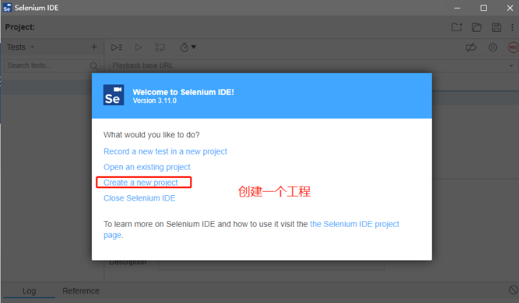

#### 2、填写项目名称以及需要测试的网站地址 

> - 创建名为【B站功能测试】的项目。进入工程的初始界面，点击tests右方的加号 “+” 就可以直接创建新的用例；
> - 创建好用例【Bilibili】后，点击右上角的 “REC "（快捷键CRTL+U)就可以录制脚本，以B站为例；
> - 点击 ”REC"后，输入BASE URL【https://www.bilibili.com/】。

#### 3、录制测试脚本 

> 开始后根据想要测试的功能模块，对Web应用进行操作，Selenium会录制用户的一系列操作，并将这些操作转换为指令集存储下来。例如要测哪些功能、操作步骤、输入的数据、预期的结果等。

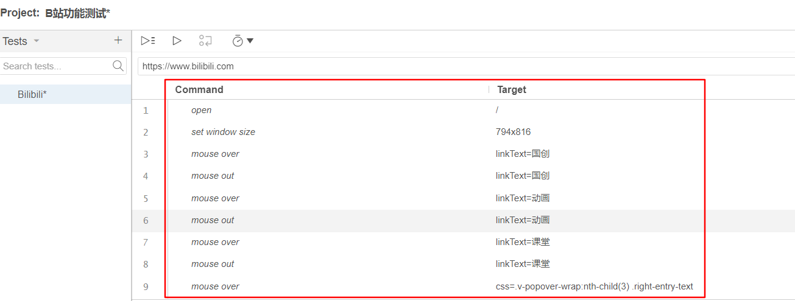

#### 4、点击执行测试按钮后，Selenium将执行脚本中的指令集 

#### 5、分析测试结果 

> 查看日志输出中的运行结果，分析测试执行的结果，若出现问题，则记录问题，并找出应用程序的问题所在。

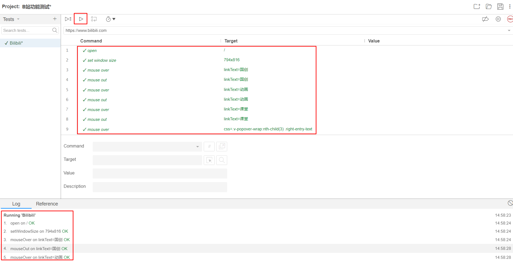

#### 6、导出测试用例 

> 可以尝试将测试脚本导出成代码的形式并运行，如导出成JUnit。
>
> - 右击测试用例
> - 点击【Export】
> - 选择【Java JUnit】

#### 7、将代码复制到IDEA中，在setUp中添加一段加载驱动的代码，即可运行测试

>  注意：chromedriver的版本一定要与Chrome的版本一致，不然就不起作用。[下载地址](*https://npm.taobao.org/mirrors/chromedriver/*)
>
>  当然，你首先需要查看你的Chrome版本，在浏览器中输入:
>
>  ```c
>  chrome://version/
>  ```
>
>  例如我的版本是100.0.4896，所以下载：100.0.4896.20。

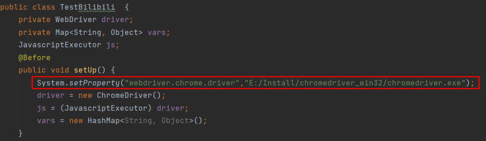

#### 8、运行结果

点击运行，可以发现运行成功。

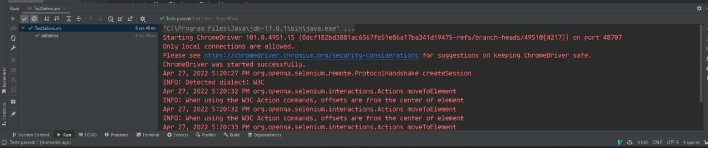

### Ⅱ、postman使用

#### 1、Postman基础功能

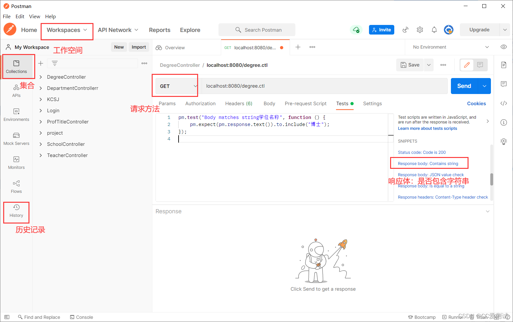

> **1、侧边栏**
>
> postman侧边栏可进行查找、管理请求和集合操作。包含了Collections、APIs、Environments、Mock Servers、Monitors、History。
>
> ①、Collections选项卡：用来创建和管理集合，可根据不同的项目来自定义保存接口请求集合，方便日后的测试记录。
> ②、History选项卡：接口请求历史记录，用来展示发送过的请求。
>
> **2、工具栏**
>
> **3、构建器**
>
> 上半部分是请求构建器、下半部分是响应构建器。
>
> ①、Cookies：单击“Cookies”链接，打开“MANAGE COOKIES”，在这里可以管理与请求相关的Cookies。
>
> **4、控制台**
>
> ①、postman控制台：其包含HTTP请求和响应的运行日志。View----Show Postman Console；
>
> ②、DevTools控制台
>
> **5、菜单栏**
>
> **6、状态栏**
>
> **7、选项卡和窗口**

#### 2、请求区域介绍

> 1、`Authorization`：身份验证，主要用来填写用户名密码，以及一些验签字段,postman有一个helpers可以帮助我们简化一些重复和复杂的任务。当前的一套helpers可以帮助你解决一些authentication protocols的问题。
>
> 2、`Headers`：请求的头部信息。
>
> 3、`Body`：post请求时必须要带的参数，里面放一些key-value键值对。
>
> 4、`Pre-requerst Script`:可以让你在 请求之前自定义请求数据，这个运行在请求之前，语法使用JavaScript语句。
>
> 5、`tests`：tests标签功能比较强大，通常用来写测试，它是运行在请求之后。支持JavaScript语法。Postman每次执行request的时候，会执行tests。测试结果会在tests的tab上面显示一个通过的数量以及对错情况。它也可以用来设计用例，比如要测试返回结果是否含有某一字符串。
>
> 6、`form-data`：它将表单数据处理为一条消息，以标签为单元，用分隔符分开。既可以单独上传键值对，也可以直接上传文件（当上传字段是文件时，会有Content-Type来说明文件类型,但该文件不会作为历史保存，只能在每次需要发送请求的时候，重新添加文件。）；post请求里**较常用的一种**。
>
> 7、`x-www-form-urlencoded`：对应信息头-application/x-www-from-urlencoded，会将表单内的数据转换为键值对；
>
> 8、`raw`：可以上传任意类型的文本，比如text、json、xml等,所有填写的text都会随着请求发送；
>
> 9、 `binary`：对应信息头-Content-Type:application/octet-stream，只能上传二进制文件，且没有键值对，一次只能上传一个文件, 也不能保存历史，每次选择文件，提交；

#### 3、常用的tests用法

> 1、测试response Headers中的某个元素是否存在 tests["元素Content-Type是否存在"] = postman.getResponseHeader("Content-Type");
>
> 2、定义一个xxx，获取headers值 var.xxx = postman.getResponseHeader("key");
>
> 3、检查response的code值是否为200 tests["Status code is 200"] = responseCode.code === 200;
>
> 4、检查response的body中是否包含字符串 tests["Body matches string"] = responseBody.has("type");
>
> 5、检查Response Body是否等于字符串 tests["测试点"] = responseBody === "Response Body返回的内容";
>
> 6、检查Response time 是否小于200ms tests["Response time 小于200毫秒"] = responseTime < 200;
>
> 7、postman.setNextRequest()是一个带有一个参数的函数，它是接下来要运行的请求的名称或ID。往往用来跳转至某个接口，只在运行该集合时有用，单独运行无效。

#### 4、tests使用示例（检查百度搜猫返回请求状况）

> ```js
> //一、检查返回值
> pm.test("检查返回内容是否正确", function () { pm.expect(pm.response.text()).to.include("<title>猫_百度搜索</title>"); }); //二、检查状态码
> pm.test("检查状态码", function () { pm.response.to.have.status(200); }); //三、检查响应时间
> pm.test("检查响应时间小于300ms", function () { pm.expect(pm.response.responseTime).to.be.below(300); });
> ```
>
> 依次添加上述断言条件，点击Send发送请求。
>
> 显示结果：
>
> 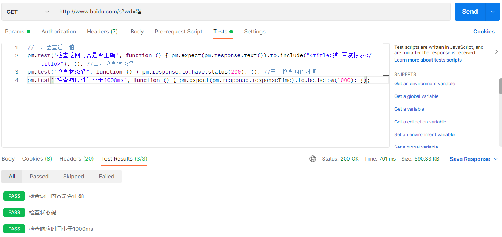

#### 5、接口自动化测试(以测试天气为例)

> 新建一个collection，向其中添加要测试的接口并保存，最后run collection，自动测试这个collection中的所有接口。

这个网站的接口增加注册给出了appid和app密码访问时要注意看接口文档

- 免费版接口： https://tianqiapi.com/free/day
- 免费版接口文档：https://tianqiapi.com/index/doc?version=day

这次我们操作一个实践测试，主要是Postman的一些主要模块的操作和使用URL，是一款可以获得天气的API，地址如下：

```html
https://yiketianqi.com/free/day
```

分别测试合肥、上海、苏州的天气，可以看到结果如下：

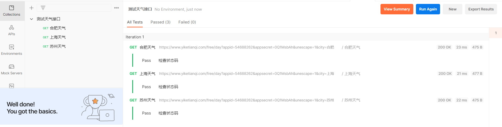

说明测试成功！

## 三、尝试selenium+爬虫

> 在实际的网络数据抓取过程中，经常会发现一些网页内容在网页源代码中查找不到的情况，因为这些内容都是通过JavaScript动态生成的，此时，使用普通的requests库无法直接获取相关内容。这时候就需要借助于Selenium模拟人操作浏览器，从而获取动态生成的内容。Selenium是一个用于Web应用程序测试的工具，Selenium测试直接运行在浏览器中，就像真正的用户在操作一样。Selenium支持大多数常用浏览器，例如IE、Mozilla Firefox、Safari、Google Chrome等等。

### Ⅰ、安装Selenium

- 第一步：安装配置Python环境，并安装pip组件。

- 第二步：在命令行工具中执行如下命令。

  ```c
  pip install selenium
  ```

- 第三步：检查是否安装成功，再次执行上面命令。

### Ⅱ、配置浏览器驱动

- 第一步：查看支持的浏览器驱动，依次执行命令：

  ```python
  python
  from selenium import webdriver
  help(webdriver)
  ```

- 第二步：选择需要使用的浏览器驱动Webdriver，根据电脑的浏览器版本下载对应的驱动到本地。

- 第三步：将下载的驱动，拷贝到python安装目录。

### Ⅲ、使用selenium进行爬虫

> 下面通过一个简单的例子，演示使用Selenium抓取网页数据的流程， 使用 selenium 的 API 获取CSDN中某位博主的文章标题及其链接，该博主的文章列表页面为：https://blog.csdn.net/Dream_Gao1989?spm=1001.2101.3001.5343

关键代码如下：

```python
from selenium import webdr iver
driver_ path = r"D:\chromedriver.exe" # 驱动所在路径
browser = webdriver . Chrome(executable_ path=driver_ path) #打开浏览器
browser. get( 'https ://blog . csdn . net/Dream Gao1989?spm=1001. 2101. 3001.5343') # 打开博客列表页
blogs = browser. find_ elements_ by_ xpath("//div[@class= ' article-item -box csdn-tracking - statistics']")
#获取所有博客
for blog in blogs:
	title = blog. find_ element_ by_ xpath(" ./h4/a" ). text #获取博客标题
    href = blog. find_ element_ by_ xpath(" . /h4/a" ). get_ attribute("href") # 获取博客详情页链接
    print(title, href, sep="\t") # 打印信息
```

执行结果（部分）如下：

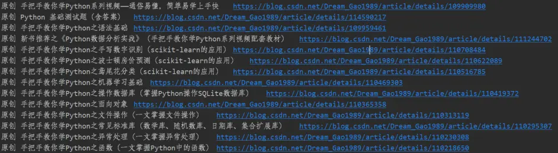
