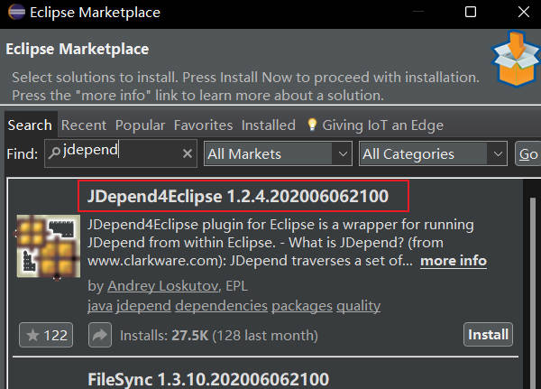
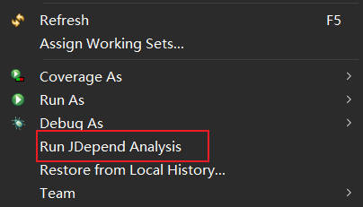

## 实验四 : 软件质量保障

**71119103 许润**

[TOC]

### 一、软件度量（JDepend）

#### Ⅰ、安装Jdepend

打开Eclipse，打开Help->Eclipse Marketplace选项，搜索Jdepend，安装即可。



#### Ⅱ、Jdepend使用

右键想要分析的/src目录或包运行，点击“Run Jdepend Analysis”。



#### Ⅱ、Jdepend结果分析

**结果如下：**


> 结果报告中有CC、AC、Ca、Ce、A、I、D、Cycle!这8种指标，具体含义如下：
>
> - CC -Concrete Class Count： 实体类数目
> - AC - Abstract Class (and Interface) Count：抽象类数目
> - Afferent Couplings (Ca)：向心耦合
> - Efferent Couplings (Ce)：离心耦合
> - Abstractness (A)：包的抽象度
> - Instability (I)：衡量一个包的不稳定程度。I=Ce/(Ce+Ca)。它的值处于[0，1]之间。I=0时说明包是最稳定的，反之I=1则说明包
> - Distance from the Main Sequence (D)： 评价包的抽象程度与稳定程度的平衡关系
> - Package Dependency Cycles：包的循环依赖度

**结果分析：**

（1）对于所有包来说，

- 向心耦合Ca为0和离心耦合Ce 均为 0 ， 说明其没有被外部或包依赖，稳定性较好;并且说明它们也不依赖其他包，功能 内聚。

- I为0，说明这些包非常稳定。
- 没有循环依赖问题。

（2）对于包cha10、11、5、7、8来说，

- 抽象度为0，指标D 为 1 ，说明这些包的平衡程度被严重破坏。

（3）对于包cha4，

- 抽象度为0.2，指标D 为 0.8，，说明该包的平衡程度被破坏，但是没有其他包的破坏严重。

### 二、形式化验证(TLA+)

#### Ⅰ、工具TLA+安装

在浏览器搜索“TLA+ Toolbox”，进入官网，下载Toolbox，解压文件后，直接双击toolbox.exe打开即可使用。


#### Ⅱ、工具TLA+使用

（1）创建名为SimpleAllocator的模块


（2）设置如图所示参数，运行


（3）结果分析

死锁结果如图所示：


**死锁产生原因分析：**

阅读程序可知，该程序为生产者-消费者问题。是一个多线程同步问题的经典案例。该问题描述了两个共享固定大小缓冲区的线程——即所谓的“生产者”和“消费者”——在实际运行时会发生的问题。生产者的主要作用是生成一定量的数据放到缓冲区中，然后重复此过程。与此同时，消费者也在缓冲区消耗这些数据

对于参数：Producers：{ ”p1”, ”p2”,  ”p3”}，Buffer Capacity ：2，Consumers：{ ”c1”,"c2"}

系统中有3个生产者进程和2个消费者进程。生产者进程每次生产一个产品放入缓冲区，消费者进程每次从缓冲区中取出一个进程并使用，那么他们之间具有这样一层关系：
（1）生产者、消费者共享一个初始为空、大小为2的缓冲区。
（2）只有缓冲区没满时，生产者才能把产品放入缓冲区。否则必须等待 (缓冲区没满->生产者生产)
（3）只有缓冲区不空时，消费者才能从中取出产品，否则必须等待 (缓冲区不空->消费者消费)
（4）缓冲区是临界资源，各进程访问时要求互斥 (互斥访问)

**根据Error-Trace我们可以分析出产生死锁的步骤：**

当缓冲区满并且所有生产者阻塞时，此时开始清空缓冲区，由于生产者数量大于缓冲区大小，因此缓冲区清空后仍会阻塞一个生产者；这时连续两次选择消费者线程，会导致两个消费者线程全部被阻塞，形成buffer = 0且 waitSet = <p,c,c>的状态；因此下一步将会选择两次生产者线程，同时唤醒一个生产者线程和一个消费者线程（此时缓冲区满），从而阻塞了一个消费者线程。同理，经过同样的过程会阻塞另一个消费者线程，从而使五个线程全部阻塞，导致死锁。

### 三、运行监控

#### Ⅰ、工具JProfile安装

> 在浏览器搜索“Jprofiler”，进入官网，下载Jprofiler 9.2，直接安装即可。


#### Ⅱ、配置 idea 和 JProfiler

> 在Idea中搜索Jprofiler插件并安装。


#### Ⅲ、工具JProfile使用

（1）启动Jprofiler，选择一个运行在JVM上的进程监控。


（2）监控结果概览

> 选择完成后，JProfiler便会进行JVM监控操作，在Overview上可以总览内存、GC垃圾回收、Classes、线程以及CPU使用情况：


#### Ⅳ、在Idea中使用 JProfiler

（1）设置VM options 参数


（2）运行内存溢出的测试程序


（3）查看刚刚运行程序的开销


从最大对象角度查看开销，可以清楚的发现 ArrayList 开销很大，达到了3145KB。


根据结果，我们可以发现是程序的第4 行 和 第1 1 行导致了内存溢出的问题。通过验证，发现确实是以下代码造成了该问题。

```java
line 4：  byte[] Array = new byte[1 * 1024 * 1024];
line 11： list.add(new OOMTest());
```

结果正确！
